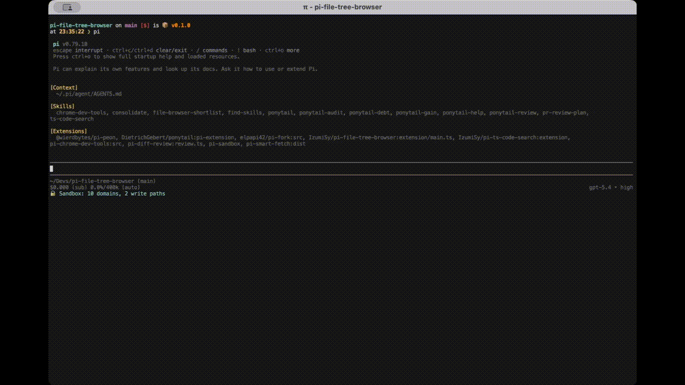

# pi-file-tree-browser

A pi TUI file browser extension.



## Features

- Open a nerdtree-like file browser with `/files`
- Navigate directories, preview files, and make quick edits inside the TUI
- Fuzzy-search Git-tracked files
- Capture AI-provided result shortlists in TUI and reopen them with `/files-result`
- Pin entire files or line ranges and pass them as high-priority context to the next agent turn
- Review or remove pins with `/pins`, or clear everything with `/pins clear`

## Install

```bash
pi install git:github.com/IzumiSy/pi-file-tree-browser
```

## Usage

This extension is intended for TUI mode.

### Slash commands

| Command | What it does |
| --- | --- |
| `/files` | Open the file browser rooted at the current working directory. |
| `/files-result` | Open the latest AI-provided shortlist of files or ranges. |
| `/files-result clear` | Clear the latest AI-provided shortlist. |
| `/pins` | Review and remove pins queued for the next agent turn. |
| `/pins clear` | Clear all queued pins. |

### Browser controls

These controls apply after opening `/files` or `/files-result`.

- `j` / `k`, `↑` / `↓`: Move
- `l` / `→`: Open directory / preview file
- `h` / `←`: Go to parent directory, leave search, or close preview
- `q`: Close the current screen, or close the browser from the root screen
- `Enter`: Open file in the editor
- `a`: Create a file, or a directory by ending the name with `/`
- `m`: Rename or move the selected file or directory
- `d`: Delete the selected file or empty directory with confirmation
- `o`: In search-result preview, reopen the file in the tree view
- `y`: Copy the previewed file to the clipboard
- `/`: Search files, or search inside the previewed file
- `s`: Pin the current file or selected preview range
- `Ctrl+S`: Pin the whole file
- `v`: Mark the start/end of a preview range
- `?`: Show help

### How pinning works

Pins are a lightweight way to tell pi, "this file or snippet matters for my next message."

- Pins are **next-turn only**. They are attached to the next agent turn, then cleared automatically.
- A **file pin** marks an entire file as important context.
- A **range pin** captures a specific line range from the preview and includes that snippet as high-priority context.
- Use **`Ctrl+S`** to pin the whole file immediately.
- Use **`v`** to mark the start of a range, move the cursor, press **`v`** again to mark the end, then press **`s`** to pin just that selection.
- This is useful when you want the agent to focus on one function, one error-producing block, or a small relevant snippet instead of a whole file.

### How `/files-result` works

Extensions and skills can set a curated shortlist of file locations through the `set_file_browser_results` tool.

In TUI mode, that shortlist is stored without opening automatically. If the input editor is empty, the extension prefills `/files-result` for you, and the shortlist also appears in the widget area. If the editor already has input, the shortlist stays in the widget area and can be reopened with `/files-result`, where you can preview, edit, and pin the suggested files or ranges.

This package also ships a `file-browser-shortlist` skill for investigations that end by adding a shortlist to the file browser.

### `/pins`

Shows the pins currently queued for the next turn, so you can review and remove them before sending your next message.

- `/pins`: open the pin manager
- `/pins clear`: remove all queued pins

## Development

See [DEVELOPMENT.md](DEVELOPMENT.md)
